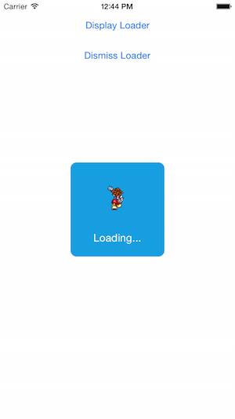
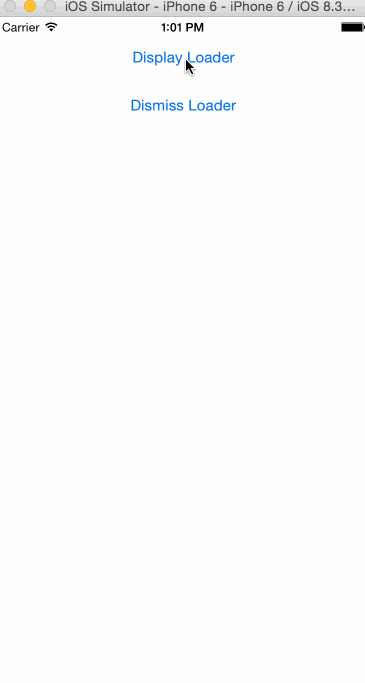

# SBAnimatedLoaderView
- Simple Swift class that animates an UIImageView inside a UIView. A UILabel can be set as well
- iOS 8.3 Swift 1.2 <br>


# Initialisation
- Just copy the class into your project and call SBAnimatedLoaderView()
- You must copy your sprites or images into your project directory and give them a name like sora_0, sora_1 etc...
- While choosing the spriteName, juste give every character before your sprite number (e.g: sora_)
Example :
```swift
var loader = SBAnimatedLoaderView()
    override func viewDidLoad() {
        super.viewDidLoad()
        let width = 150 as CGFloat
        let frame = CGRectMake((self.view.frame.width - width) / 2, (self.view.frame.height - width) / 2, width, width)
        let LoaderbackgroundColor = UIColor(red: CGFloat(22.0/255.0), green: CGFloat(158.0/255.0), blue: CGFloat(224.0/255.0), alpha: CGFloat(1.0))
        loader = SBAnimatedLoaderView(frame: frame, color: LoaderbackgroundColor, spriteName: "sora_", numberOfSprites: 8, animationDuration: 0.8, labelString: "Loading...", labelTextColor: UIColor.whiteColor())
        // Do any additional setup after loading the view, typically from a nib.
    }
```
# Display the loader
```swift
loader.show()
```
#Dismiss the loader
```swift
loader.hide()
```
